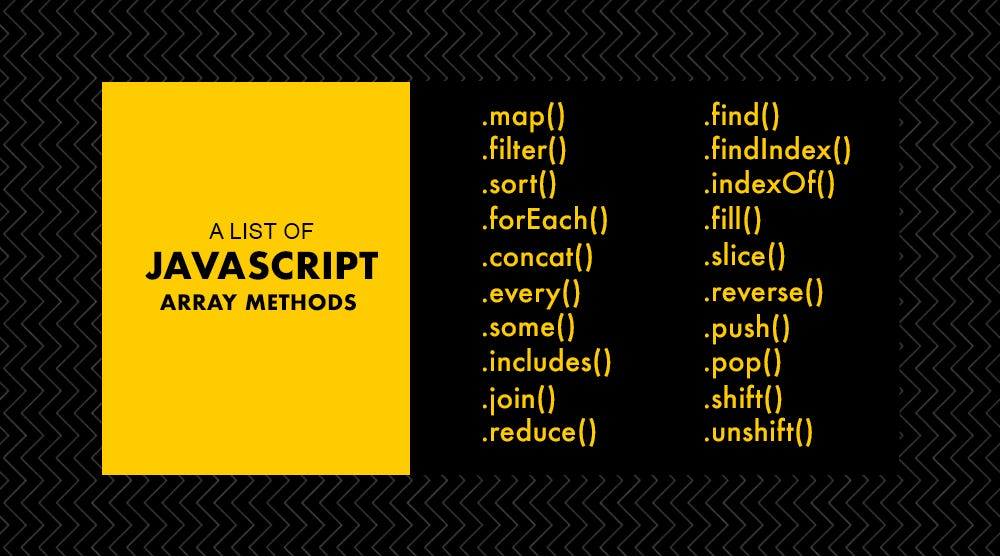
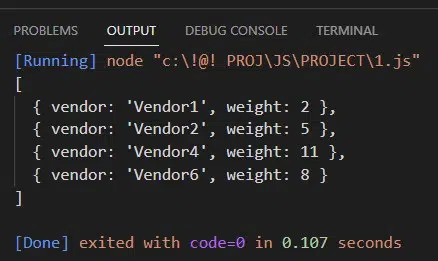
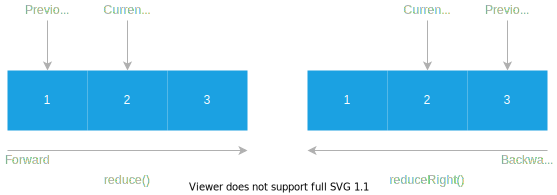
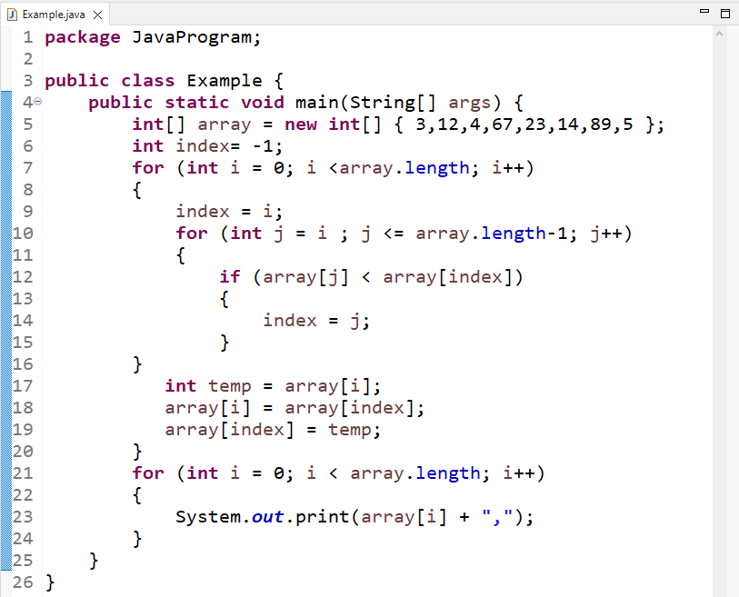
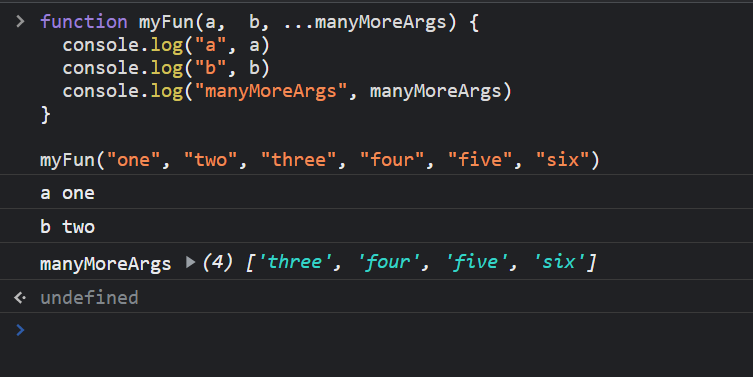

# Array methods

> forEach() > > Метод forEach() выполняет указанную функцию один раз для каждого элемента в массиве.
.jpg)

>  map() > > Метод map() создаёт новый массив с результатом вызова указанной функции для каждого элемента массива.
%20%D1%81%D0%BE%D0%B7%D0%B4%D0%B0%D1%91%D1%82%20%D0%BD%D0%BE%D0%B2%D1%8B%D0%B9%20%D0%BC%D0%B0%D1%81%D1%81%D0%B8%D0%B2%20%D1%81%20%D1%80%D0%B5%D0%B7%D1%83%D0%BB%D1%8C%D1%82%D0%B0%D1%82%D0%BE%D0%BC%20%D0%B2%D1%8B%D0%B7%D0%BE%D0%B2%D0%B0%20%D1%83%D0%BA%D0%B0%D0%B7%D0%B0%D0%BD%D0%BD%D0%BE%D0%B9%20%D1%84%D1%83%D0%BD%D0%BA%D1%86%D0%B8%D0%B8%20%D0%B4%D0%BB%D1%8F%20%D0%BA%D0%B0%D0%B6%D0%B4%D0%BE%D0%B3%D0%BE%20%D1%8D%D0%BB%D0%B5%D0%BC%D0%B5%D0%BD%D1%82%D0%B0%20%D0%BC%D0%B0%D1%81%D1%81%D0%B8%D0%B2%D0%B0..png)

> find() > > Метод find() возвращает значение первого найденного в массиве элемента, которое удовлетворяет условию переданному в callback функции. В противном случае возвращается undefined.
.png)

> filter() > > Метод filter() создаёт новый массив со всеми элементами, прошедшими проверку, задаваемую в передаваемой функции.

> reduce() > > Метод reduce() применяет функцию reducer к каждому элементу массива (слева-направо), возвращая одно результирующее значение.

> toSorted() > > The toSorted() method of Array instances is the copying version of the sort() method. It returns a new array with the elements sorted in ascending order.
%20method%20of%20Array%20instances%20is%20the%20copying%20version%20of%20the%20sort()%20method.%20It%20returns%20a%20new%20array%20with%20the%20elements%20sorted%20in%20ascending%20order..png)

>toSorted  > > The toSorted() method of Array instances is the copying version of the sort() method. It returns a new array with the elements sorted in ascending order.

> Method Destructuring > > Destructuring function parameters
JavaScript allows you to extract values from an object or array passed as a parameter to a function. Destructuring parameters is quite straightforward, as you only need to use the destructuring syntax inside the function: function greet({ name, age })  console. log `Hello, ${name}.

> spread > > Create custom spreadsheets, advanced grids, dashboards, reports, and data input forms with the comprehensive API

>  rest > > Синтаксис остаточных параметров функции позволяет представлять неограниченное множество аргументов в виде массива.

